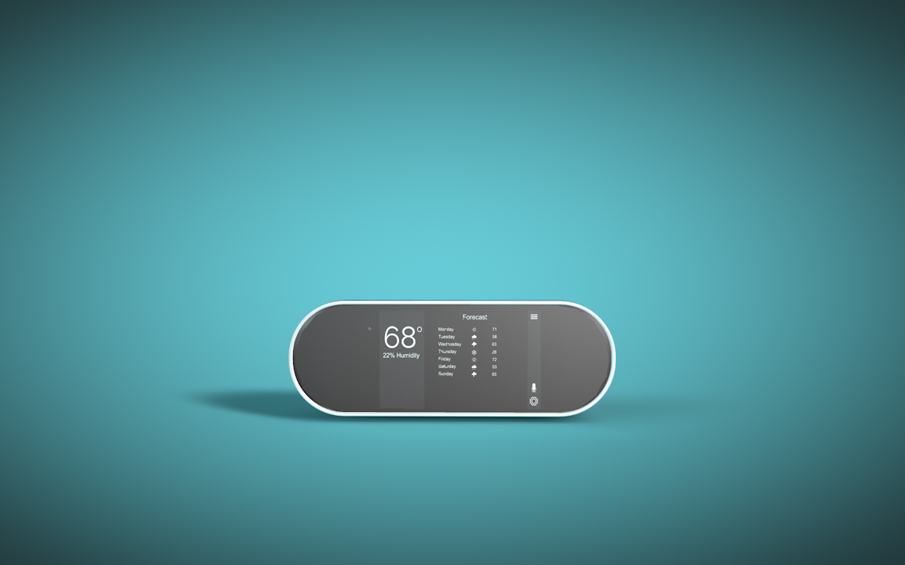

# ThermoSecure Thermostat Product Page



## Project Description:

The basis of this assignment is to create an interactive application using 3D, and still images. Design and develop an engaging experience for the end user with which they can interact in a one-page mobile-first web application.

## Getting Started

### Prerequisites

To locally host this website, you’ll need Git installed on your computer.
[See detailed install instructions here.](https://gist.github.com/derhuerst/1b15ff4652a867391f03)

### Installing

From the command line:

```# Initialize git

$ git init

# Clone this repository

$ git clone https://github.com/EmmaBlue/Blue_E_Angelozzi_C_Atkinson_J_Boyden_D_J_Robertson_J_Hackathon.git

# Go into the repository

$ cd Blue_E_Angelozzi_C_Atkinson_J_Boyden_D_J_Robertson_J_Hackathon

```

And you’re done!

## Built With:

* [MySQL](https://www.mysql.com/)
* [PHP](https://www.phpmyadmin.net/)
* [Javascript](https://www.javascript.com/) 

## Authors
* [**Camillo Angelozzi**](https://github.com/cangelozzi) - *Developer*
* [**Jacob Atkinson**](https://github.com/jiatkinson) - *Video and Motion Graphics*
* [**Emma Blue**](https://github.com/EmmaBlue) - *Project Manager*
* [**Dan Boyden**](https://github.com/OfficialDboyden) - *Designer*
* [**John Robertson**](https://github.com/tectone) - *Developer*

## Inspiration

* [Rob Hayes](https://www.robhayesstore.com/?ref=lapaninja) 